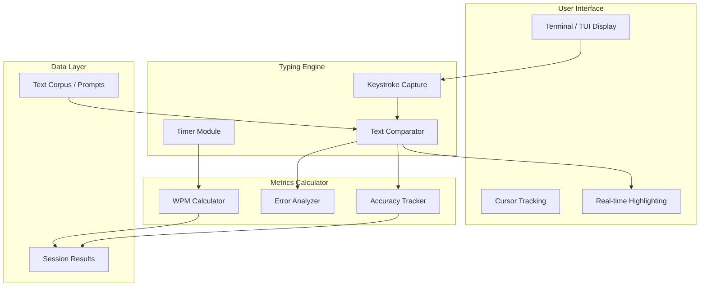

# WPM_Typing_Test ⌨️⚡

[](https://github.com/krishnakumarbhat/WPM_Typing_Test/actions/workflows/ci.yml)
[](https://python.org)

A **typing speed test** application built in Python. Measures your words-per-minute (WPM), accuracy, and provides real-time feedback as you type. Includes multiple implementations from scratch and from existing libraries.

## 🏗️ Architecture



## 🚀 Features

- **Real-time WPM tracking** — See your speed update as you type
- **Accuracy measurement** — Character-level precision tracking
- **Multiple text sources** — Built-in text corpus for typing prompts
- **Terminal UI** — Clean, responsive terminal interface
- **From-scratch implementation** — No heavy typing-test dependencies

## 🛠️ Tech Stack

| Component   | Technology                       |
| ----------- | -------------------------------- |
| Language    | Python 3.8+                      |
| UI          | curses / Terminal                |
| Text Source | Built-in corpus                  |
| Metrics     | Custom WPM / accuracy algorithms |

## 📦 Installation & Usage

### From-Scratch Implementation (Recommended)

```bash
cd typing_ai_scratch
python3 -m pip install -r requirements.txt
python3 main.py
```

### Alternative (mltype-based)

```bash
python3 -m pip install mltype
python3 tutorial.py
```

## 📁 Project Structure

```
WPM_Typing_Test/
├── typing_ai_scratch/       # From-scratch implementation
│   ├── main.py              # Entry point
│   ├── src/                 # Core modules
│   │   ├── engine.py        # Typing engine
│   │   ├── display.py       # TUI rendering
│   │   └── metrics.py       # WPM/accuracy calculation
│   ├── data/                # Text corpus
│   ├── models/              # ML models (optional AI features)
│   └── requirements.txt
├── mltype-master/           # mltype library reference
├── was/                     # Earlier prototype
├── tutorial.py              # mltype tutorial script
├── text.txt                 # Sample text
├── .github/workflows/       # CI/CD pipeline
├── .gitignore
└── README.md
```

## 🎯 How It Works

1. **Start** — Launch the app and select a text prompt
2. **Type** — Type the displayed text as fast and accurately as possible
3. **Track** — Watch your WPM and accuracy update in real-time
4. **Result** — View your final score with detailed metrics

## 📝 License

MIT License

## 🤝 Contributing

1. Fork the repository
2. Create a feature branch: `git checkout -b feature-name`
3. Commit your changes: `git commit -m 'Add feature'`
4. Push to the branch: `git push origin feature-name`
5. Open a pull request
